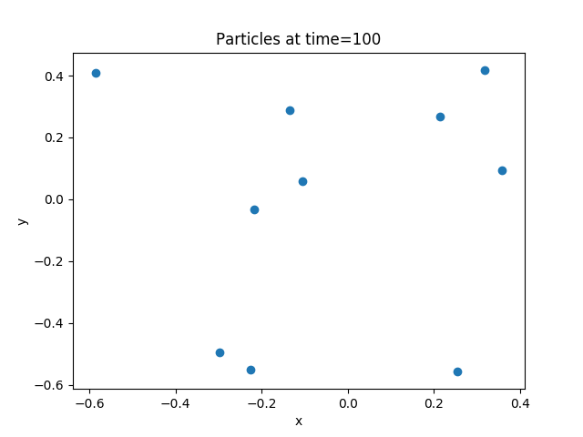
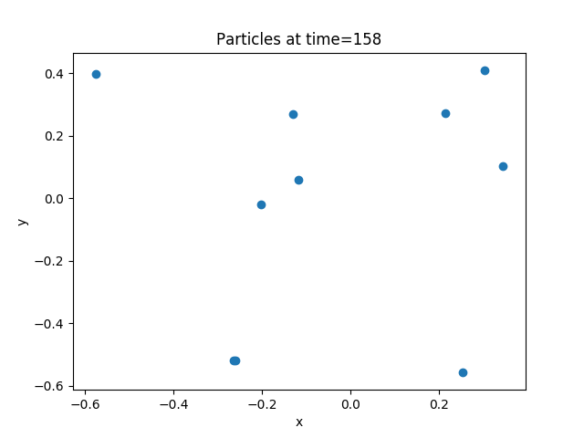
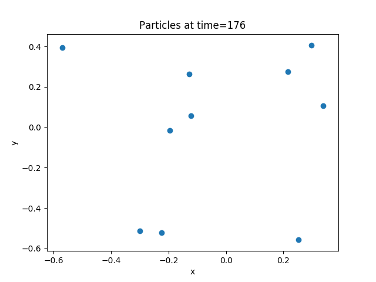

# HW 10: N-body simulation
# Mr. Patomporn Payoungkhamdee SCPY 6138171

## Theoretical relations
Consider classic gravitational force from Newtonian equation we would get

## Convention
* Set G = 1 
* Mass = 5 for all particles
* Random initial position and velocity

## 1) First order iteration methods
Using the old-fashion for serial code and also parallel algorithm with a relation as

## 2) Leapfrog Integrations
Since Taylor's expansion correction is not accuracy enough for long dt which would be exploid, in this homework I would use more accurate approach called "Leapfrog Integrations". The equation relation governed by

## Results
* The result of each method could perform well as I expect from a animation of step file. Probably second method might diverge slower than first method but not the time that we consider

