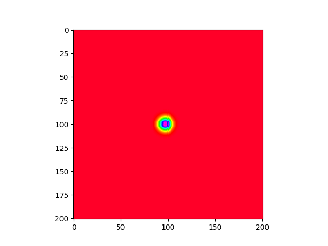
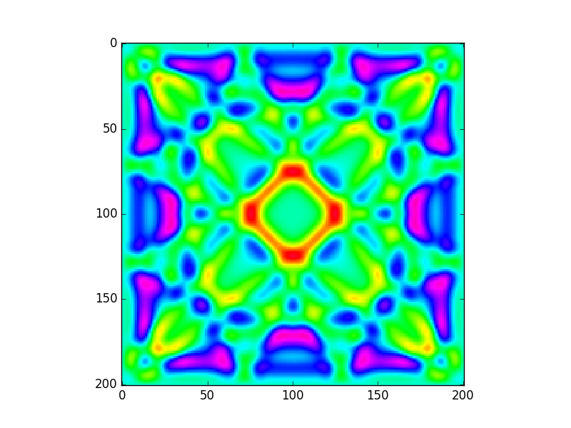

# HW: 2D Wave propagation with MPI
# Mr. Patomporn Payoungkhamdee SCPY 6138171

# Method
* Using numerical method the same as CUDA version has been done and also using same paramaters
* Master-slave technique with passing index slicing number of y to slave and get calculation of step wave back untill finish all map then update all variable and also broadcast to all slave

# Results
* Elapse time = 79 ms with 1 master 3 slaves
* At the beginning

* When passed NT

# Dependency
* Ubuntu 16.04
* CPU : Intel(R) Core(TM) i5-2400
	* 3.1 Ghz
	* 4 Cores
* GPU : GeForce GT 1030 
	* 1.38 GHz
	* 384 CUDA cores
* CUDA version 9.0