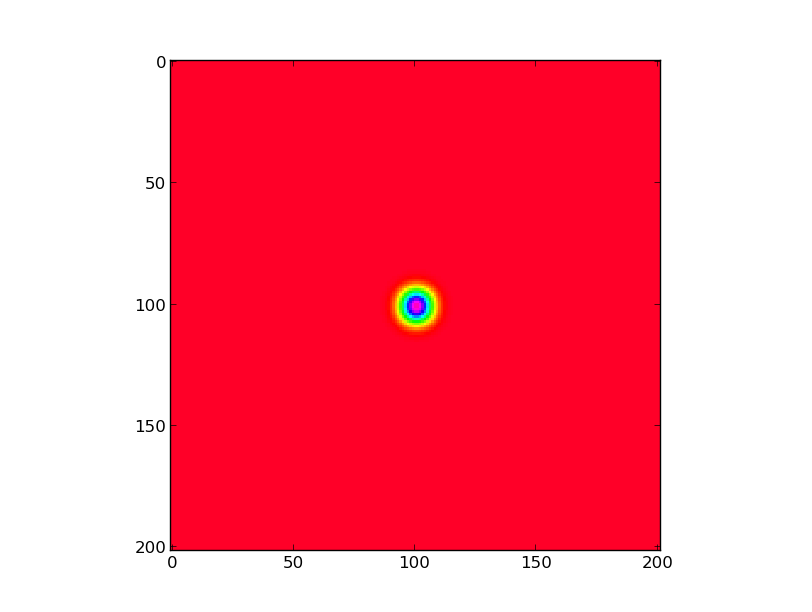
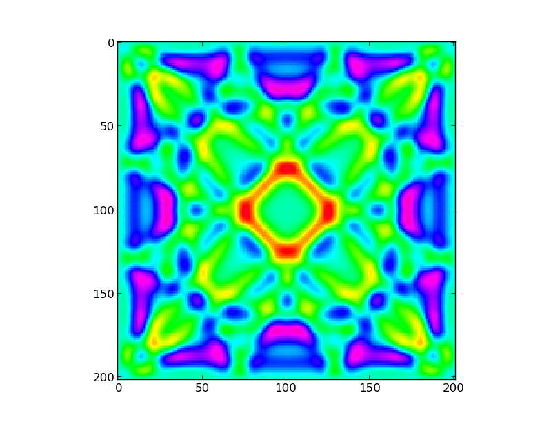
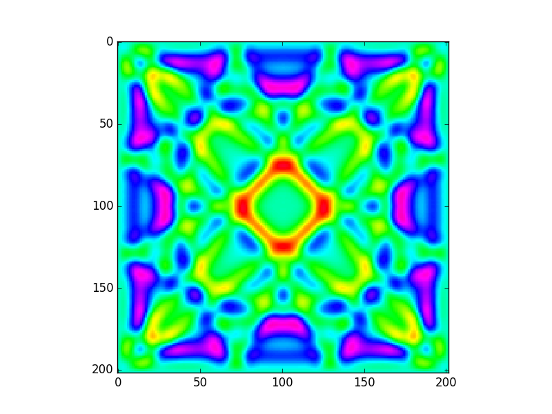

# HW : CUDA with MPI for 2D-Wave Halo Technique
# Mr. Patomporn Payoungkhamdee SCPY 6138171

## Method
* Fixed 2 static processes with their own initialize wave2d map
* compute and update halo over time between these two processes by synchoronous halo line at their boundary

## Results
### 1) MPI
Found that ordinary MPI produce a satisfied result we could see in t_0 and t_1000 in the following images

### 2) MPI with CUDA
All of the function seems to perform well and it also contains no error but I have no idea why it remain the initial state along the time as given picture

