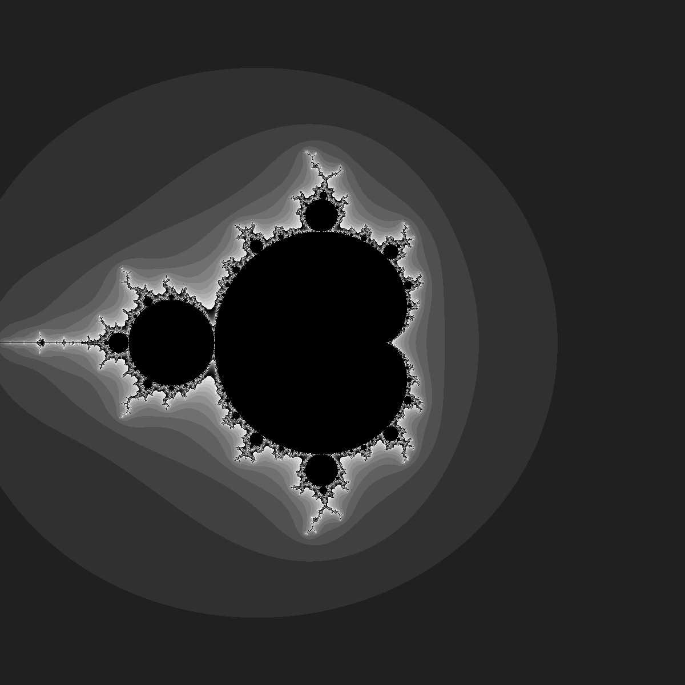

# HW 1 : For Mandebrot problem (fractral)
## Briefly how it work 
* Since z_n+1 = z_n + c where we consider complex number as x+iy and note that x, y are real
* Consider range (-2,-2) to (2,2) with square grid (600x600) => grid width would be 4/600 = 1/150
* Set max_iteration as 10,000 if converge
* Shade of (z) axis of map is shown how converge and vice versa (Diverge mark as black)

## Program
1. Define complex number
2. couple loop over grid with step sie 1/150
3. Iterate until reach max_iteration or length is explode
4. Color z-axis as 0 if explode else modulo k by 16
5. write ".ppm" file and let convert to jpg

## Result
* CPU Time: 12.250193 ms 
* GPU Time: 6.304879  ms
* Dependency
	* CPU : Intel(R) Core(TM) i5-2400 CPU @ 3.10GHz
	* GPU : GeForce GT 1030 
	* CUDA version 9.0

## 2D Map

