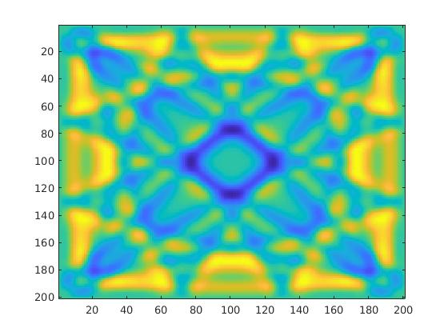

# HW 2 : 2D-Wave
## Results
* CPU time = 0.829626 s
* GPU time =  0.006661 d
## Dependency
* Ubuntu 16.04
* CPU : Intel(R) Core(TM) i5-2400 CPU @ 3.10GHz
* GPU : GeForce GT 1030 
* CUDA version 9.0
## 2D Map

