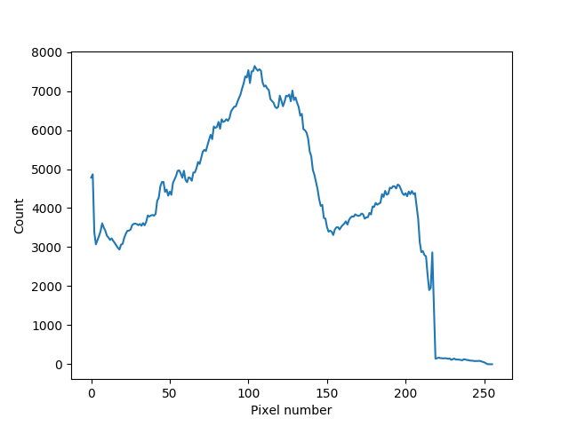

# HW 5 : Monotone

## Turtle Image

### Original Image

### Single channel Image

## Histogram counting
* Let consider a pure base 2 pixel images eg. 1024x1024 for numerical convenient at first
* For serial code it would loop over 1024x1024 array to fill in 256 bin histogram

## Parallelize
* It's kind a problematic if we are using ordinary global memory access of vector_histogram due to it might have some grid that different thread call the same address at the small period of time
* In order to get rid of this problem called "race condition", we could use an built-in atomic increment operator which provided in the standard libraly

## Results
* The results of this algorithm agreed well between serial and parallelize algorithm for all image size which provided in "img_converter.py" file but in the folloing plot just demenstrated of 1024x1024

###  Histogram from serial code

### Histogram from parallel code

## Issue
* Remember that I'm just using base-2 pixel by interpolating function in python for convenient, we could extended for more robust code if I have more time
* As you can see I literally use 32 block_size and using "CL_DEVICE_TYPE_ALL" which means it inefficient in terms of hardware and software for execute

## Dependency
* Ubuntu 16.04
* CPU : Intel(R) Core(TM) i5-2400
	* 3.1 Ghz
	* 4 Cores
* GPU : GeForce GT 1030 
	* 1.38 GHz
	* 384 CUDA cores