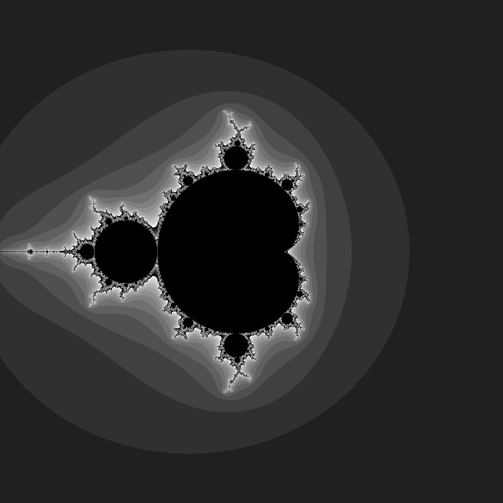

# HW 6 Open MPI : Integral and Mandelbrot set 
# Mr. Patomporn Payoungkhamdee SCPY6138171

## 1) Numerical integration
* Compute integral from any given function y(x) by using small summation over region of graph in the given range

### Method
* Integrate from X_I to X_F which dx = (X_I - X_F)/N
* 
* Notice that x_i is the middle of the small rectangle in the summation

## 2) Mandelbrot
Evaluate Mandelbrot set by dividing into sub-grid for compute and feeding back to combine into the global map

### Convention
* Suppose we have 1024x1024 grid cell and parallelly compute sub-grid with a slicing array from long map of Mandebrot
* Consider range (-2, -2) to (2, 2)
* Set max_iteration as 10,000 even it still not diverge
* Shade of map is showing how each point converge when diverge mark as black

### Method
* Initialize processes and virtually compute all processes until all done and gather sub-map (which is array) to globsl Mandebrot map
* Notice that I'm using MPI_Barrier(MPI_COMM_WORLD) to waiting until all processes done before gather and combine the result

### Result

