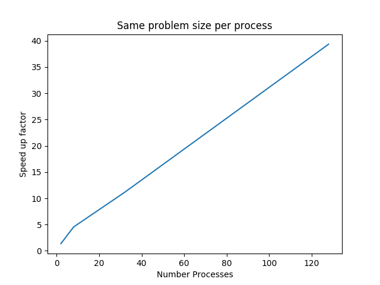

# HW 7 : Master-Slave using Open MPI
# Mr. Patomporn Payoungkhamdee SCPY 6138171

* Convention:
	* I use only 1024x1024 matrics resolution for this homework

## 1) Mandebrot set using Master-Slave
* Master-slave technuque by using slave worker compute slicing single array and send back to master until it finish
* The Result

## 2) Count computing time compare between dynamic and static load balancing

* Graph of static load balancing

* Graph of dynamic load balancing

## 3) Mandebrot within a given range in arguments
* Usage is simply could use syntax like
	* >> mpiexec -n 5 3_Mandel_GivenRange.x x_i x_f y_i y_f
* The result that we got is agree well as we expect which demenstarted as x = [0,1] and y = [0,1]

## 4) Modufying 3) into MPI static load balancing version 
This has been showing in code file

## 5) Using dynamic load balancing in 4) and compute performance

* Plot of speecup factor relatively to serial code from vary problemsizes such that size per processes is the same
* Given that speed up factor defined by using t_serial/t_parallel (I got 13.89 s as a serial prpgram)
* For a given 2^9 problem size per process
	* Results log2 vs speed up
	
	

	
	

